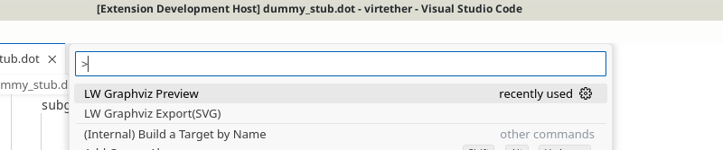
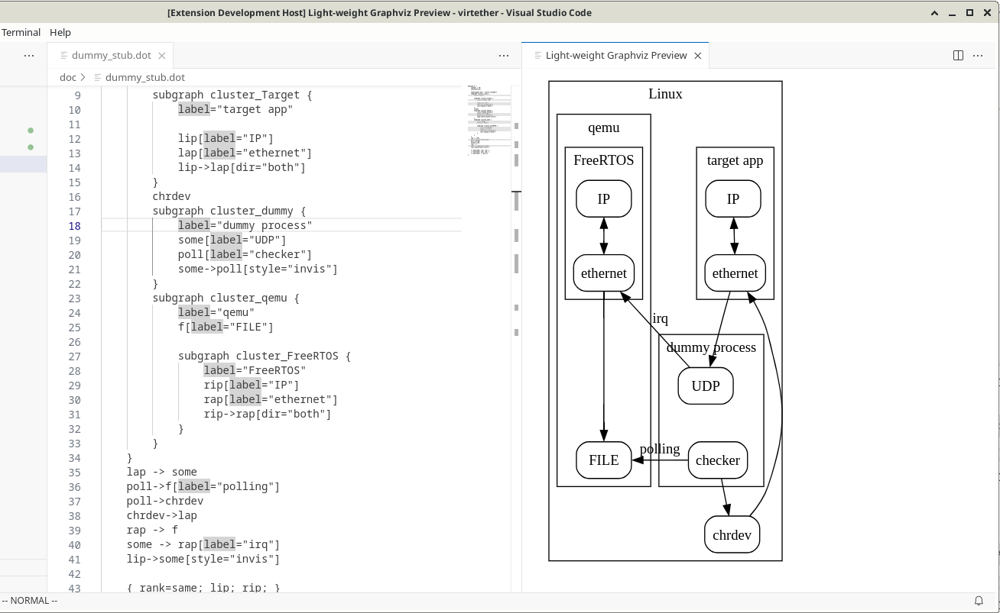
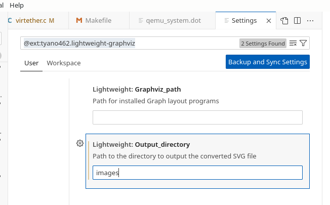

# lightweight-graphviz README

This is the README for "lightweight-graphviz".

## Features

Provides the features  Preview and Export (SVG) using the installed [graphviz](https://graphviz.org/).

You will need to install graphviz in advance.

### Preview

### Export SVG
output svg file.

## Extension Settings

- Graphviz_path  
Describe the path to Graph layout programs.  
There is no need to enter it if the path to the dot command is available.
- Output_directory  
Enter the output destination directory of the SVG file  
as an absolute path or as a relative path from the dot file.  
If not specified, the output destination will be ../images/.

## Known Issues
Operation on Windows has not been confirmed.

## Release Notes

See [Changelog](CHANGELOG.md)